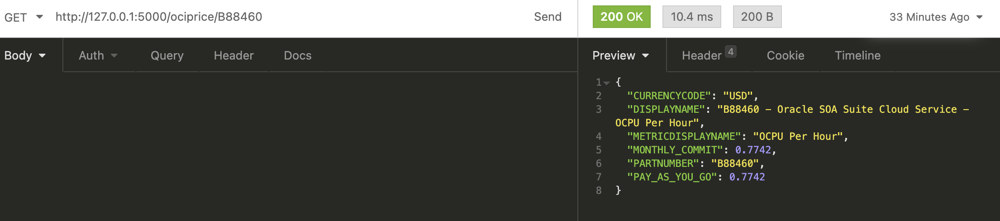

# okitpricing2mysql (WIP for integration)
moving okit pricing database from Oracle Autonomous DB(ADB) to MySQL container

Now I am accessing Oracle ADB using ORDS(Oracle REST Data Services), I will do the same approach to minimize my code changes.

What is OKIT?
Please visit: https://github.com/oracle/oci-designer-toolkit

Quick demo access (not the latest version): http://okit.oci.cool/okit/designer

### Run REST API
```sh
python app.py
```


